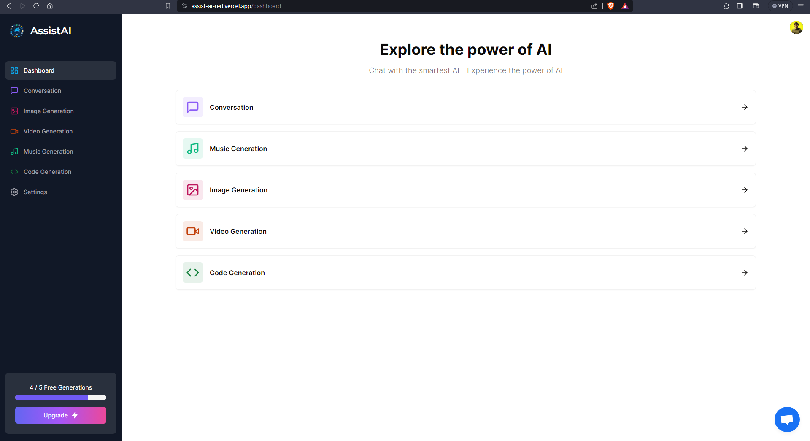

# AssistAI

Welcome to AssistAI! This is a Next.js-based web application that serves as a Software as a Service (SaaS) platform, providing access to Conversational AI assistants as well as AI generators for Images, Videos, Music, and Code. With this platform, you can unleash the power of artificial intelligence to enhance various aspects of your projects and workflows.



## Features

- **Conversational AI:** Engage with powerful conversational AI assistants that can understand and respond to natural language queries, making interactions seamless and intuitive.

- **Image Generation:** Leverage advanced AI algorithms to generate high-quality and creative images based on your specifications. Perfect for design projects or creative endeavors.

- **Video Generation:** Create unique and captivating videos using AI-driven algorithms. Tailor the content to your needs, whether it's for marketing, entertainment, or educational purposes.

- **Music Generation:** Explore the world of AI-generated music compositions. Customize the style, mood, and genre to suit your preferences and integrate the generated music into your projects.

- **Code Generation:** Simplify your coding tasks with AI-assisted code generation. Boost productivity by automatically generating code snippets based on your requirements.

## Getting Started

To get started with AssistAI, follow these steps:

1. **Clone the Repository:**
   ```bash
   git clone https://github.com/kamlesh364/assist-ai.git
   cd assist-ai
   ```

2. **Install Dependencies:**
   ```bash
   npm install
   ```

3. **Set Environment Variables:**
   Create a `.env` file in the root of your project and set the necessary environment variables. Refer to the provided `.env.example` for guidance.

4. **Run the Application:**
   ```bash
   npm run dev
   ```

5. **Access the Application:**
   Open your browser and visit `http://localhost:3000` to access AssistAI.

## Technology Stack

- **Next.js:** [Next.js](https://nextjs.org/) is a React framework that enables server-side rendering, static site generation, and a great developer experience.

- **React:** [React](https://reactjs.org/) is a JavaScript library for building user interfaces, and it serves as the foundation for the frontend of this web application.

- **AI Services:** Utilizes state-of-the-art AI models and APIs for Conversational AI, Image Generation, Video Generation, Music Generation, and Code Generation.

## Contributing

We welcome contributions from the community! If you find any issues, have suggestions, or want to contribute to the development of AssistAI, please check out our [Contributing Guidelines](CONTRIBUTING.md).

## License

This project is licensed under the [MIT License](LICENSE).

## Support

For any questions or assistance, feel free to reach out to us at [kkamlesh.p47@gmail.com].

Happy coding and exploring the possibilities with AssistAI!

## Deploy to Google Cloud Run

[](https://deploy.cloud.run)